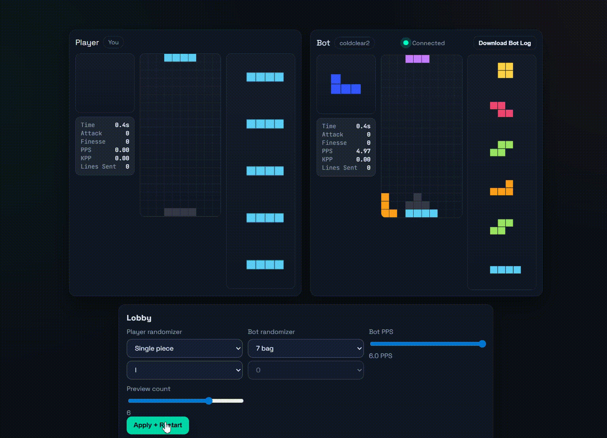

# Rust + WebAssembly Tetris (1v1 vs coldclear2)
Play against ColdClear2 with cool randomizers such as select a piece and lovetris (which is basically the reverse of Hatetris)
## Building
1) Install the wasm target and wasm-pack if you have not yet:
```bash
rustup target add wasm32-unknown-unknown
cargo install wasm-pack
```
2) Build the WASM bundle into the web folder:
```bash
wasm-pack build --target web --out-dir web/pkg
```
3) Serve the `web` directory with the built-in Rust static server:
```bash
cargo run --bin server
```
4) Open `http://localhost:8080` in a browser. Use the controls panel to change bindings, randomizers, and bot PPS. Settings persist automatically.

## ColdClear2 TBP bridge
We vendor cold-clear-2 in `cold-clear-2/` and provide a websocket bridge that can spawn and talk TBP to the bot.

Run the bridge:
```bash
cargo run --bin bot_bridge -- --listen 127.0.0.1:9000 --bot-path cold-clear-2/target/release/cold-clear-2.exe
```


## Notes
- DAS/ARR values are stored in settings and surfaced in the UI; the movement pipeline is frame-based and can be extended from `src/lib.rs` if you want stricter input timing.
- Colors follow the guideline palette. Grid visibility options are rendered in `web/main.js`.
- If you switch randomizers or PPS, click **Apply + Restart** to rebuild the session with the new configuration.


